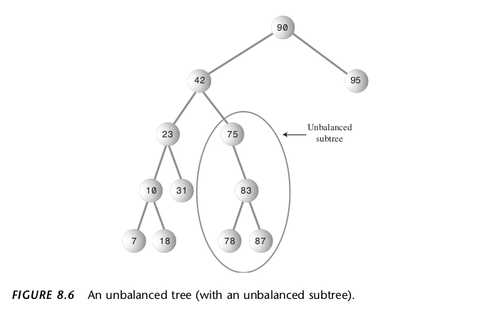
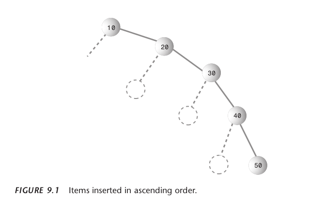
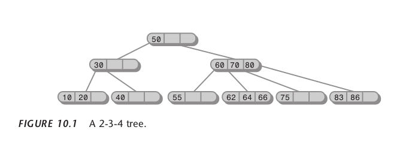
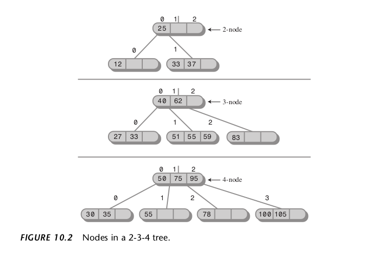

# About this repository
This is a little repository I created to implement a few data strucutes I'm learning about using the old, but really good book by Robert Lafore: `Data Structures and Algorithms in Java`.

Right at the beggining the author introduces a tool called `Workshop Applets` for data visualization. I assume this is available somewhere, but I've found an online browser implementation that can be accessed [here](https://spro.blog/lafores-applets/). Big ups to Stanislav Proshkin, who created it. 

Of course there are other tools out there as well like [this one](https://www.cs.usfca.edu/~galles/visualization/), so feel free to seek them out.

## Table of contents

- [About this repository](#about-this-repository)
- [The Big O Notation](#the-big-o-notation)
  - [Introduction](#introduction)
  - [How to think ](#how-to-think)
- [Sorting](#sorting)
  - [Bubble-sort](#bubble-sort)
  - [Selection-sort](#selection-sort)
- [Advance Sorting](#advance-sorting)
  - [Shellsort](#shellsort)
- [Data Structures](#data-structures)
  - [Definition](#definition)
  - [Arrays](#arrays)
  - [Ordered Arrays](#ordered-arrays)
  - [Stacks](#stacks)
  - [Queues](#queues)
  - [Dequeues](#deques)
  - [Priority Queues](#priority-queues)
  - [LinkedLists](#linkedlists)
  - [Double-ended LinkedLists](#double-ended-linkedlists)
  - [Doubly LinkedLists](#doubly-linkedlists)
  - [Iterators](#iterators)
  - [Recursion](#recursion)
  - [Binary Trees](#binary-trees)
  - [Red-Black Trees](#red-black-trees)
  - [2-3-4 Trees](#2-3-4-trees)
- [The java collections framework](#the-java-collections-framework)

## The big O notation

### Introduction
In summary the Big O Notation is a way to analyze the performance of an algorithm. Usually speaking, perfomance within an algorithm can be a little tricky to define and it can be describe using a variety of methods. The first and most obvious one is time in seconds for example. Let's take an example for a simple array:

Assume you have an array of int numbers, like this one:

```java
int[] array = { 5, 2, 10, 1, 5, 7, 8, 3, 17, 18, 19, 1, 6, 14, 12 };
```

You can ask yourself how long it would take for a number, lets say 8, to be searched inside the array. Or you maybe you want to know the time to add a new number (maybe 1000) to it. Answering these questions in terms of seconds or fractions of seconds can depend on a multitude of factors, such as CPU model, temperature, other processes running concurrently etc. Although tools that can calculate this exist and can be really useful maybe there is another way to determine efficiency and performance.

### How to think 
Instead of thinking about raw time in seconds let's think about how time relatively increases or decreases based on the array's size.

Generally speaking when you have an unordered array and you search for a given element inside it you need to interate, on average N/2 times, where N is the array's size. If you double the array size you just double the iterations. So we can abstract way the actual time by thinking about how much steps or operations are performed on an array (or any data-structure) when we increase its size. In this case, we say that the time for this search operation is linear and proportional to the array's size:

* Search in unordered array: O(n)

To delete an item you need to search it first, so you can describe like:
* Delete in unordered array: O(n)

To insert an item you only need one operation, as it'll be inserted at the array's end. This is contant time:
* Insertion in unordered array: O(1)

Of course, this example doesn't consider factors like duplicate values, null values etc, but demonstrates the strategies for analysing algorithms.

Here's an image from the book that displays a graph of different time complexities:


Once we analyse the image we can crearly see how different time complexities behave once the collection's size increases.

* O(1) operations are the fastest, because they don't depend on the collection's size.
* While not as good as constant time, O(logN) operations are performant.
* Linear or O(n) is ok, the time increases proportionally with size.
* O(n²) is horrible, yet there is another one, O(n!) which is even worse than that.

Idealy speaking we would like to make all operations constant time O(1) and although this is not possible we can choose the right data-structure for the right task. Part of the effort when creating algorithms is to consider what operations would be done and from there decide what operations (based on their time complexity) we should implement.

## Sorting
Sorting is the process of organizing and ordering a collection of data based on a condition, like a key value (1, 2, 3...) or alphabetical order (a, b, c...), for example. The topic of sorting is extremely important because they can severely impact perfomance and lots of sorting strategies exist. Initially, for begginers it's nice to study the simpler ones.

The Workshop applets are EXTREMELY useful for sorting visualization.

### Bubble sort
This sorting algorithm is the probably the most simpler, but also extremely inefficient. Real world applications won't use, because its time complexity is O(n²), but its simple implementations helps understanding how sorting works. 

Bubble sort works by taking the item at position 0 and comparing it to the next, at position 1. If it's bigger swap the items and proceed with the next (comparing index[1] to index[2], for example) and so on. Items that are bigger will be pushed one at the time to the end of the array. You can also think of it as sorting items from left to right.

Time complexity for the bubble sort is horrible and, as the mentioned earlier, and for both swaps and comparisons the time is O(n²).


### Selection sort
Selection sort works by iterating over the array and storing the index of the smallest element. Once you reach its end you swap the smallest and the first items. Index[0] holds the smallest item and it's sorted. Iterate the array again starting from the second item.

Selection sort is an improvement from bubble sort, it decreases the number (not time complexity mind you) of swaps from O(n²) to O(n), but leaves the comparisons' number as O(n²). Smaller datasets are better sorted with selection, but for really large ones the improvement is not too significant.


### Insertion sort
Insertion sort runs at O(n²) like selection and bubble sorts, but it's about twice as fast as bubble and somewhat faster than selection sort.

The algorithm considers one marked element and stores it outside the array, then items at the left of the store item are shifted one position to the right until you reach the end of the array or you find an item that is equal or smaller than the stored item, at which time you can insert the stored item at that position. Sorted items are placed continuously at the left side until everything is ordered. 

## Advance Sorting
The previous sorting strategies were rather slow, there are however better and faster options.

### Mergesort
Recursion can be used on lots of different scenarios and sorting is one of them. The algorithm that uses this strategy is called mergesort. This algorithm takes O(n*log n), which can be really fast for large data sources.

It works by re

### Shellsort
This stragery is called shellsort after its discover, Donald L. Shell in 1959

## Data structures

### Definition
Data structures can be define as an arrangement of data that can be manipulated in different ways. Arrays are on themselves data structures albiet simple and straightforward, but you can find more complex ones, like binary trees, graphs etc. They help developers solve difficult problems by modeling real-world scenarios and also can simplify and abstract away complex implementations. 

The topics of algorithm perfomance, big O notation and data structures are closely related. Different structures provide different implementations of insertion, deletion, search and traversal that can be faster os slower depending on the structure in question and its size for example. Each operation can have a time complexity associate with it and it's useful to describe these operations based on these metrics.

### Arrays
Linear, fixed-size, zero index-based, data structures. The most basic data structure that can also be used to implement other, more complex ones.

Time complexity for unordered, non-null, non duplicate values:
* Insertion: O(1)
* Deletion: O(n)
* Search: O(n)

Time complextity for unordered, non-null, duplicated allowed values:
* Insertion: O(1)
* Deletion: O(n)
* Search: O(n)

### Ordered Arrays
Ordered arrays are normal arrays, but sorted by some value. This property comes in handy when you consider the time complexity for binary search O(logN).

Time complexity for ordered arrays:
* Insertion: O(n)
* Deletion:
* Search: O(logN) using binary search

### Stacks
Stacks, like queues, are more abstract data strucutures when compared to arrays, usually used by programmers as tools for acomplishing a task they help with difficult problems and can even be used in conjuction with other data structures.

Instead of an array, where all element can be accessed at any time (given you provide the index), stacks have a restriction for element access. They follow a principle where elements are placed on top of each other and you can only access the last element inserted and this position is called `top` of the stack. This access restriction is famously described by the acronym FILO (first-in, last-out).

It's possible to define the core operations for stacks as the following:

* Peek returns the value stored at the stack's top
* Push adds an element at the top of the stack
* Pop removes the element at the top and returns it 

Stacks can be implemented with different structures, like an array or a linkedList, for example, but for the user (or client), it really doesn't matter what implementation is choosen, since the FILO principle is followed.

Because of their access restriction the time complexity for operations mentioned above is constant:
* Return the top element: O(1)
* Insertion on stack: O(1)
* Deletion from stack: O(1)

The following image ilustrates how these operations work:


### Queues
Queues are another data structures that can be used more as a tool than a storage system. They are similar to stacks in the fact they provide a access restriction to their elements. Stacks follow the FILO principle, but queues follow the FIFO (first-in, first-out) principle, very much like queues in real life. To acomplish this queues must track the front and back elements and these variables are usually called `front` and `rear`.

Like stacks queues can be implemented using a variety of data-structures.

Common operations for queues are as follow:
* Insert a new element at the rear position
* Remove an element at the front position
* Peek to return the value at the front position

Again, like stacks, the access restriction allows for extremely fast operations in constant time:
* Insert: O(1)
* Remove: O(1)
* Peek: O(1)

The following image represents the operations done in a queue:


One thing to notice it that when you implement a queue using an array you don't really move the items around, like when queue and dequeue elements you just move the rear and front variables to point to different elements. This is because moving the item would require copying, deleting and adding them to another array, which would require extra time O(n) and operations, while moving the pointers of rear and front is O(1).

### Deques
Dequeues are more versatile than stacks and queues, and they allow the possibility of adding and removing elements from both ends (the front or read). They can be used in some use cases, but because their are not as common as the 2 previous ones the book chooses not to discuss them futher.

### Priority Queues
Priority queues are normal queues with a front and rear, but one caviat, the items are stored ordered by a given key value. Elements with lower keys are stored at the front and higher ones are the rear (although this can be inverted in some implementations). Since elements are ordered by a key value insertion on a priority queue doesn't happen only in the back, but rather it's put on their appropriate position, which can be slower or faster depending on your implementation.

The advantage here is clear, you can assign elements a value and they will called for execution based on they level of priority.

Usually you want a quick insertion with priority queues and they are often implemented with using a heap, another data structure that will be discussed later.

Time complexity for priority queues using an array implementation:
* Insertion: O(n)
* Deletion: O(1)

### LinkedLists
Linked lists are propably the second most used data structure. They are extremely versatile and can replace arrays on many different use cases, improving operations such as insertion, deletion and search quite a lot. Also, they can be used, as noted before, to implement data structures like queues and stacks.

LinkedLists can have multiple types, like singleLinkedLists, doublyLinkedLists, lists with iterators and more.

Lafore names the elements of a linked list as `links`, but another name used out there is `nodes`. Each node or link contains the element itself and a reference to another link, such as each node points to the next node on the list. This way we can create a similar structure of an array, a linear one that is, but that can hold an indefinite amount of nodes (the size is given by the amount of memory available) and it's dinamically sized.


Given the enormous amount of possible implementations, let's assume you can only insert items at the start and that there is only three possible operations: insertion, deletion and iteration (sometimes called traversing the list). The time complexity for them are as follow:

* Insertion: O(1)
* Deletion: O(n)
* Iteration: O(n)

The advantages of using a LinkedList instead of an array:

1. LinkedLists are dinamically sized.
2. Because they are not sequential within the memory you don't need to move items once you remove or add elements.
3. They occupy only the amount of memory needed.

On the other hand, you "pay" the price for this in both complexity and by adding a reference for the next element inside each link.

### Double-ended LinkedLists

LinkedLists have a variable that tracks the first element of the list. If you want to insert an element at the end of this list you have to iterate over it until you find the last element and this takes O(n). Because of this inefficency it's possible to store a reference for the last element as well, then you can insert elements at both ends of the list in O(1) time:


This approach is useful when, for example, implementing a queue with a linkedlist.

### Doubly LinkedLists

While in a single linked list each element holds a reference to the next element, a doubly linked list holds two references: one for the next element and one for the previous one. This approach allows for traversing in either direction, we can go from the first to the last element and vice versa. This would not be possible on a single linkedlist.

The image below provides a visual representation of a doubly linked list. Note that each element contains two references, one for next and one for the previous elements.


Note that we can know when the list starts and when it ends by look at the previous and next references:

* If the element's next points to null you at the end (like with single linked lists).
* If the element's previous points to null you at the beginning.
* If both references point to null then the list is empty.

Although their name is similar, double-ended and doubly linked lists are different and they should not be confused with each other.

Doubly linked lists have two main drawbacks, first a little overhead is added by keeping an extra reference inside each link and second is that when inserting and deleting elements you need to handle 4 references instead of 2.

Time complexity for operations are:

* Insertion or deletion at beginning or end of the list: O(1)
* Insertion or deletion within the list: O(n)
* Searching (traversal): O(n)

### Iterators

Traversing a list is a common task and all types of list implementations do this to search, add or remove an element. Let's analyse an insertion on a ordered list:

1. the user calls the method
2. somehow, the method performs the traversal
3. then inserts the item inside the list

Note that during this process the users themselves don't have any control on how the traversal is done. A user might want to traverse a list of employees and update the salaries of the ones who earn more than 2k a month, but not alter the others. An array provides index-based access and this traversal-control it's trivial, but how can a list expose an access for its links? 

A possible solution is to provide for the class' user a reference that points to each link. This reference can be updated as the list is traversed, allowing the user to perform any operation he wants just by accessing the object's reference.

Following OO principles we can use a class Iterator to allow the user to create multiple references for the links in the list, so we can access them like we do within arrays.


Although each use case may require specific operations, Iterators generally provide methods like:
* Traversal (going from on link to the next)
* Add or remove elements at certain positions (calling the list's methods for it)
* Inform the user if the current item is at the start or end of the list

### Recursion
Recursion is an extremely useful programming technique for solving problems complex problems. It involves a method calling itself. You can imagine that a recursive function performs a similar operation of a for-loop or while-loop, so a function must call itself based on an condition, therefore avoiding infinite loops and this is called base case.

It can be a bit hard to understand how a particular recursion executes, so there are three key-concepts involved:

1. Base Case – Stops the recursion when a condition is met.
2. Recursive Case – Calls itself with a smaller or modified version of the problem.
3. Call Stack – Each recursive call is pushed onto the stack and popped off when returning.

Recursion approaches are useful when you have a problem can be expressed by itself. Factorials are a good example of this. The factorial of a number can be expressed by another factorial, that can be expressed by another factorial and so on... It implies a certain circular behavior or pattern involved in it and this behavior can be expressed as a function that calls itself over and over until a certain condition is met. Once this happens the return values are returned, one for each calling.

Although a recursive approach is beneficial it also be a bit inefficient. It's possible to solve recursive problems using a stack implementation which can be useful sometimes, some compilers for example can use a stack to implement recursion. 

The reason we talked about recursion is because they are a key component when studying a data structure called binary trees.

### Binary Trees

Binary trees combine the advantages of two data-structures: ordered arrays and linkedlists. They combine the quick insertion and deletion of linkedlists and the fast search from ordered arrays.

As the name suggests a binary tree is a type of tree. We can think of a tree as Nodes that are connected to each other. A A Node can be anything, but in the context of java it will most certainly be an object. The following images provides a visual representation of a general tree with its Nodes and their connections:


In principle you can only go from one Node to another by following their connection and in terms of code, a connection is a reference for another object. As you can see, there is a somewhat resemblence of a LinkedList with its links and next/previous references.

The following image shows the terminology of each tree component:


A tree is a rather complex structure with a lot of parts in it, so this is a brief description of its most importent concepts:

* <b>Path: </b> is a sequence of connected Nodes
* <b>Root: </b> Node located at the top of the tree, the only Node that doesn't have a parent.
* <b>Parent: </b> a Node with downward connections to other Nodes
* <b>Child: </b> is a Node with upward connections to other Nodes.
* <b>Leaf: </b> a Node that doesn't have any children. A tree can have only one root, but may have multiple leaves.
* <b>Subtree: </b> sub section of a tree where you can take the Node at a top and consider it a root for that section. 
* <b>Visiting: </b> is when a program control arrives at a certain Node, usually to perfom some operation in it. Passing throught it without performing anything (during a path for example) is not considered visiting the node.
* <b>Traversing: </b> is the visiting all Nodes within an order, like visiting all Nodes by ascending key-value.
* <b>Levels: </b> means how many layers or "generations" a certain Node is away from root Node. If we assume root to be level 0, then it's children are on level 1, grandchildren at level 2 and so on.
* <b>Keys: </b> it's common to define some field inside an object as it's identifier, for example personId or something similar, so keys are used to identify and order each Node within a tree.

#### The definition of a Binary tree
A tree is called binary if its Nodes contain zero or at most 2 children. These children are called <i>left child</i> or <i>right child</i> depending on their position. This restriction implies that each child can only have one direct parent.

Technically speaking, the tree we are discussing here is called a <i>binary search tree</i> and the following image represents one with its key values at the center of each Node:


Note that another important characteristic of binary trees is that <b>left child Nodes must have their key values lower than it's parent, and right child Nodes must have a key value equal or bigger than its parent.</b> This property is extremely useful, for it allows the Nodes to be ordered and searched effectively.

Operations on a binary tree are a bit more complex compared to previous structures, so let's describe then bellow. 

1. <b>Search: </b> when searching for an element the time depends on how many levels down the item is located. While the number of item can increase exponentially, the number of levels increases linearly, so it's really efficient. In fact, the time complexity for this operation is O(N.logN), which is really efficient when the collection's size increases 

2. <b>Insertion: </b> insertion requires first look a proper Node, choosing the right path if the key is bigger than the visited node or left if it's smaller and checking if the proper position is null. Because of that, the time complexity for insertion is O(N.logN) also. 

3. <b>Traversal: </b> as noted before, traversal is the process of visiting each node in a specified order and although this is a not a super common operation to carry out it can be important in some cases. There are three ways of traversing a BTS: <i>preorder</i>, <i>inorder</i> and <i>postorder</i>. Inorder is the most common strategy and it uses recursion to visit each node sequentially.


Note that these estimations are for relatively well balanced trees, if your tree is unbalanced the then the time approaches O(n), as the tree starts resembling more and more a linkedlist. Unbalanced tree can negatively affect many operations. Deciding which one should be root and how you insert items can prevent a tree becoming too unbalanced, the following image shoes one such tree:



### Red-black trees
As mentioned before, BST have fast insertion, deletion and search times. At first glance they appear ideal, but there is one small problem: a BST can become unbalanced and the time complexity degenerates more and more to O(n) as the unbalance increases. 

If the data is inserted randomly the chance of a tree becoming too unbalanced gets lower, but if the data is inserted is ordered or partially ordered the structure becomes more like a LinkedList:



Even an small unbalancing can affect the times substiantially. On a simple BST this problem can be hard to solve, therefore it's necessary to implement a funcionality to balance the tree. On Red-Black trees this is achieved by checking for a few conditions. Basically, a "color" (or any attribute for that matter) can be added to each node. During insertion or deletion a few rules can be followed and balance can be (mostly) maintained.

The rules are called red-black-rules:

1. A node can be either red or black.
2. The root node is always black.
3. If a node is red it's children must be black (the contrary is not necessarily true though).
4. Every path from the root to a leaf, or to a null child, must have the same number of black nodes.

If an element insertion violates these rules you can use two strategies to fix it:

1. Change the color of a Node.
2. Perform a rotation.

These operations are useful, but rotations are the most important strategy used by rbtrees to maintain balance. They need to be performed in such a way where the structure of a BST should maintained, so as to preserve the fast operations times.

The book doesn't provide an implementation. I will for sure implement one later, but there are other, more important ones to work with. 

### 2-3-4 Trees
Another data-structure that can be classified as a tree are 2-3-4 trees. Unlike binary-search trees and red-black trees, 2-3-4 trees can have more than two children. They can also be called <i>multiway trees</i> and they are quite interesting and useful in some situations. 

2-3-4 tress are balanced, like bts and rbt, but they are easier to implement than the latter.

The following image shows a representation of this tree with its multiple children:



Note that each Node inside a 234-tree can hold three items and have four children. Inside this tree all leaf nodes (nodes that have no children) are always in the same level. 

#### Structure
For non-leaf nodes there are 3 possibilities:

1. A node with one data item must have two children
2. A node with two data itens must have three children.
3. A node with three data itens must have four children.

You can also describe it with the expression `L = D + 1` where L is the number of links a node can have and D is the number of children.

Leaf-nodes don't have children, by definition, but they can have 1 or up 4 items. Empty or nodes are NOT allowed.

Because the nodes inside a 234tree can have up to 4 children, it can also be called <i>multiway tree of order 4</i>.

The following image shows how we can name the Nodes and it's links:



By convention the nomenclature can be described as followed:

* Links are named from left to right as <b>0</b>, <b>1</b>, <b>2</b> and <b>3</b>
* The itens inside each node are named from left to right as <b>0</b>, <b>1</b> and <b>2</b>. They are organized in ascending order.
* the node itself can be named as <b>2-node</b>, <b>3-node</b> or <b>4-node</b> depending on how much links/children it has. Remember that leaf-nodes don't have children.

Like a BTS, these characteristics where set so we can insert, search and delete efficient.  

#### Search
Search on a 234tree works very much like a BST one.
1. You start in the root node and check each item inside it for a match.
2. If not found, then you need to determine which child to check next (based on its key).
3. If you do this and reach a leaf-node then the item does not exist inside the tree.

## The java collections framework
The concept of performance and complexity is especially important when working with `data collections`. This term is very appropriate within the Java world within the `Collections Framework`. On itself this is "just" a collections of classes, interfaces and algorithms to help developers program and work with sets of data in a standardlized and efficent manner.

For more info about it check the official docs at oracle:

* [Java SE 8 - The Collections Framework](https://docs.oracle.com/javase/8/docs/technotes/guides/collections/)
* [Tutorial: collections](https://docs.oracle.com/javase/tutorial/collections/intro/index.html)